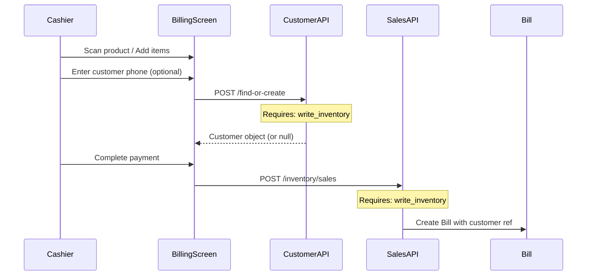

# Customer Permissions Architecture

## 📋 Overview

This document explains the permission model for customer management in the Shivik Mart system, including the rationale behind using inventory permissions and considerations for future architecture.

---

## 🏗️ Current Architecture

### Permission Model

**Customer routes use:**
- `read_inventory` - For viewing customer records
- `write_inventory` - For creating/updating customer records

**Location:** `backend/routes/customerRoutes.js`

### Why Inventory Permissions?

#### 1. **Operational Coupling**
Customer records are tightly integrated with the sales/billing workflow:
- Customers are created/found during billing (`POST /api/v1/customers/find-or-create`)
- Bills reference customers (optional field in `Bill` model)
- Sales processing requires `write_inventory` permission (see `inventoryRoutes.js:289`)

**Flow:**
```
Billing Screen → Find/Create Customer → Process Sale → Create Bill
     ↓                    ↓                    ↓              ↓
Requires:          Requires:          Requires:        Stores:
write_inventory    write_inventory    write_inventory  customer ref
```

#### 2. **Logical Grouping**
Staff who can process sales (requiring `write_inventory`) should also be able to:
- Create customer records for walk-in customers
- Update customer information during billing
- View customer history for billing context

#### 3. **Consistency with Workflow**
- **Sales/Billing operations** = `write_inventory` permission
- **Customer management** = Part of sales/billing operations
- **Therefore:** Customer management = `write_inventory` permission

---

## 📱 Future Architecture

### Two Distinct Customer Concepts

#### 1. **Internal Customer Records (Current System)**
- **Purpose:** Walk-in customer profiles for billing
- **Created by:** Store staff during POS transactions
- **Used in:** Bills, sales history, customer lookup
- **Permissions:** `read_inventory` / `write_inventory`
- **Scope:** Internal POS/Inventory Management System

**Characteristics:**
- Optional during billing (can be null for anonymous walk-ins)
- Created via `find-or-create` pattern (phone-based lookup)
- Stored in `Customer` model with `customerNumber` (CUST0001, CUST0002, etc.)
- Referenced in `Bill` model as optional field

#### 2. **End-User Customer Accounts (Future System)**
- **Purpose:** Customer-facing mobile app for browsing and ordering
- **Created by:** Customers themselves (self-registration)
- **Used in:** Product browsing, stock visibility, online orders
- **Permissions:** Separate authentication system (not part of internal permissions)
- **Scope:** Separate customer-facing mobile application

**Future Features:**
- Customer login/authentication
- Product catalog browsing
- Real-time stock quantity visibility
- Online order placement
- Order history
- Separate user management system

---

## 🔄 Current Customer Flow

### Customer Creation During Billing



### Customer Routes & Permissions

| Route | Method | Permission | Purpose |
|-------|--------|------------|---------|
| `/api/v1/customers` | GET | `read_inventory` | List customers (pagination, search) |
| `/api/v1/customers/:id` | GET | `read_inventory` | Get customer by ID |
| `/api/v1/customers/find-or-create` | POST | `write_inventory` | Find or create by phone (billing) |
| `/api/v1/customers/phone/:phone` | GET | `read_inventory` | Get customer by phone |
| `/api/v1/customers` | POST | `write_inventory` | Create new customer |
| `/api/v1/customers/:id` | PUT | `write_inventory` | Update customer |
| `/api/v1/customers/:id` | DELETE | `write_inventory` | Soft delete (set isActive=false) |

---

## 🤔 When to Change Permissions?

### Keep Current Model If:
- ✅ Customer management remains part of sales/billing workflow
- ✅ No need for separate customer management roles
- ✅ Staff who can process sales should manage customers
- ✅ Simple permission model is preferred

### Consider Separate Permissions If:
- ❌ Need to grant customer read/write separately from inventory
- ❌ Adding customer management features beyond billing (loyalty, marketing)
- ❌ Requiring stricter separation for audit/compliance
- ❌ Different roles need different customer access levels

### Proposed Separate Permissions (If Needed):
```javascript
'read_customers'   // View customer records
'write_customers'  // Create/update customers
'delete_customers' // Delete/deactivate customers
```

**Note:** If implemented, these would typically be granted together with inventory permissions since they're used in the same workflow.

---

## 📊 Permission Comparison

### Current System Pattern

| Entity | Read Permission | Write Permission | Delete Permission |
|--------|----------------|------------------|-------------------|
| Products | `read_products` | `write_products` | `delete_products` |
| Suppliers | `read_suppliers` | `write_suppliers` | `delete_suppliers` |
| Purchase Orders | `read_purchase_orders` | `write_purchase_orders` | N/A (status-based) |
| Inventory | `read_inventory` | `write_inventory` | N/A (adjust_inventory) |
| **Customers** | **`read_inventory`** | **`write_inventory`** | **`write_inventory`** |

### Why Customers Are Different

Unlike other entities (products, suppliers, purchase orders), customers are:
- **Operational data** (created during transactions) vs. **Master data** (pre-configured)
- **Optional** (billing works without customers) vs. **Required** (products/suppliers are required)
- **Transaction-linked** (part of sales workflow) vs. **Standalone** (managed independently)

---

## 🔐 Security Considerations

### Current Model Security

**Strengths:**
- ✅ Consistent with sales workflow permissions
- ✅ No permission escalation (same level as sales processing)
- ✅ Simple to understand and maintain

**Considerations:**
- ⚠️ Staff with `write_inventory` can manage customers (intended behavior)
- ⚠️ No granular control between inventory and customer management
- ⚠️ Customer data access tied to inventory permissions

### Future Customer App Security

The future customer-facing app will have:
- **Separate authentication system** (not using internal permissions)
- **Customer self-registration** (no staff involvement)
- **Read-only product/stock access** (no inventory write permissions)
- **Order placement** (creates orders, not bills directly)

**No conflict** with internal permission model since it's a separate system.

---

## 📝 Implementation Details

### Customer Model Reference

**File:** `backend/models/Customer.js`

**Key Fields:**
- `customerNumber` - Auto-generated (CUST0001, CUST0002, ...)
- `phone` - Optional, unique, sparse index
- `name` - Optional, defaults to "Walk-in Customer"
- `isActive` - Soft delete flag

**Key Methods:**
- `generateCustomerNumber()` - Atomic sequence generation
- `findOrCreateByPhone()` - Phone-based lookup/create

### Bill Model Reference

**File:** `backend/models/Bill.js`

**Customer Fields (all optional):**
- `customer` - ObjectId reference to Customer
- `customerNumber` - String (denormalized)
- `customerName` - String (denormalized)
- `customerPhone` - String (denormalized)

**Note:** Bills can be created without customer (anonymous walk-ins).

---

## 🎯 Decision Summary

### Current Decision: Use Inventory Permissions

**Rationale:**
1. Customers are operational data created during sales
2. Sales require `write_inventory` permission
3. Customer management is part of sales workflow
4. Future customer app will be separate system (no conflict)

### Future Considerations

When the customer-facing app is built:
- **Internal system:** Continue using `read_inventory`/`write_inventory` for walk-in customer records
- **Customer app:** Separate authentication, no internal permissions needed
- **Integration:** Customer app orders may create internal customer records (via API with `write_inventory`)

---

## 📚 Related Documentation

- `CUSTOMER_BILLING_FLOW_DIAGRAM.md` - Detailed billing flow with customers
- `BILLING_IMPLEMENTATION_SUMMARY.md` - Billing system overview
- `backend/routes/customerRoutes.js` - Customer API routes
- `backend/models/Customer.js` - Customer model definition
- `backend/models/Bill.js` - Bill model with customer references

---

## 🔄 Migration Path (If Needed)

If separate customer permissions are required in the future:

1. **Add to User model enum:**
   ```javascript
   'read_customers', 'write_customers', 'delete_customers'
   ```

2. **Update customerRoutes.js:**
   ```javascript
   requirePermission('read_customers')  // Instead of read_inventory
   requirePermission('write_customers') // Instead of write_inventory
   ```

3. **Update frontend constants:**
   ```javascript
   READ_CUSTOMERS: 'read_customers',
   WRITE_CUSTOMERS: 'write_customers',
   ```

4. **Grant permissions to existing users:**
   - Typically grant together with inventory permissions
   - Or create migration script to copy inventory permissions

---

**Last Updated:** 2024
**Status:** Current architecture - using inventory permissions
**Future:** Separate customer app will use independent authentication


